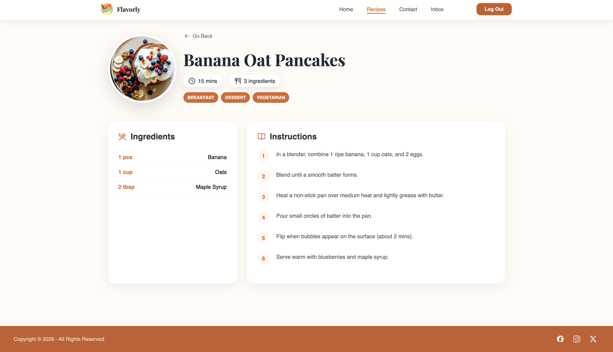
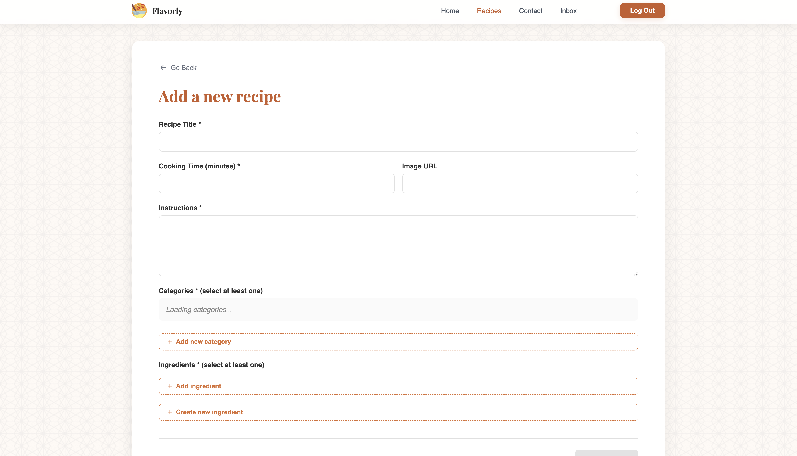
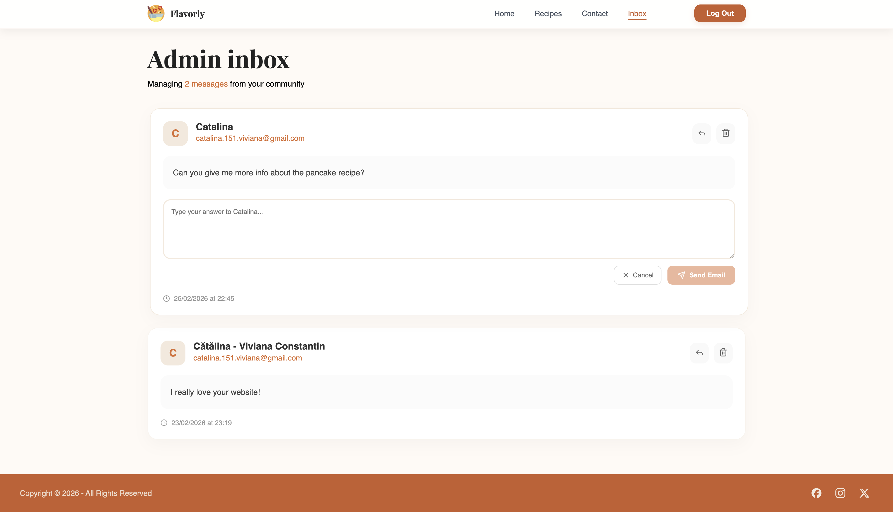
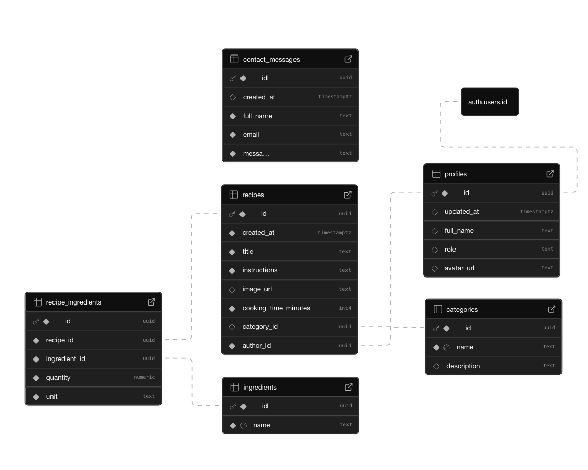

# Flavorly Recipe App

A modern recipe management web application built with React, Vite, Redux Toolkit, Supabase, and CSS Modules. Designed for both users and admins, featuring authentication, recipe CRUD, contact inbox, and responsive UI.


## Features

- Browse, search, and filter recipes
  
  

- See details about each recipe
  
  

- Add and delete recipes (admin only)
  
  

- User authentication (register, login, email verification, password reset)
- Admin inbox for contact messages
  
  

- Responsive design and accessibility
- Toast notifications for feedback
- Modular, maintainable codebase

## Technologies Used

- **React** (with hooks)
- **Vite** (for fast development/build)
- **Redux Toolkit** (state management)
- **Supabase** (PostgreSQL, authentication, storage)
- **CSS Modules** (scoped styling)
- **Lucide React** (icons)
- **react-router-dom** (routing)

## Supabase Schema

The app uses Supabase for backend services. Below is the schema for the main tables:



- `profiles`: Stores user info and roles
- `recipes`: Recipe data
- `contact_messages`: Contact form submissions

> See `docs/schema.sql` for full SQL schema.

## Getting Started

### 1. Clone the repository

```bash
git clone https://github.com/catalina-constantin/Recipe-App/
cd Recipe-App
```

### 2. Install dependencies

```bash
npm install
```

### 3. Configure Supabase

- Create a project at [supabase.com](https://supabase.com)
- Create tables using `docs/schema.sql`
- Enable Row Level Security and set policies for `profiles`, `recipes`, and `contact_messages`
- Get your Supabase URL and anon/public key
- Copy `.env.example` to `.env` and fill in your credentials:

```env
VITE_SUPABASE_URL=https://your-project.supabase.co
VITE_SUPABASE_KEY=your-anon-key
```

- Your `src/supabaseClient.js` should use these environment variables:

```js
export const supabase = createClient(
  import.meta.env.VITE_SUPABASE_URL,
  import.meta.env.VITE_SUPABASE_KEY,
);
```

### 4. Run the app

```bash
npm run dev
```

- Open [http://localhost:5173](http://localhost:5173) in your browser

## Folder Structure

```
src/
  components/
    ... (UI components)
  pages/
    ... (page views)
  services/
    ... (API logic)
  store/
    ... (Redux slices)
  styles/
    ... (CSS Modules)
  utils/
    ... (helpers)
docs/
  schema.sql
  supabase-schema.png
```

## Admin Features

- Inbox page for contact messages (visible only to admin)
- Recipe management (CRUD)
- Role-based access control

## Accessibility & Responsiveness

- All pages and components are accessible and mobile-friendly

## License

This project is for educational purposes.
